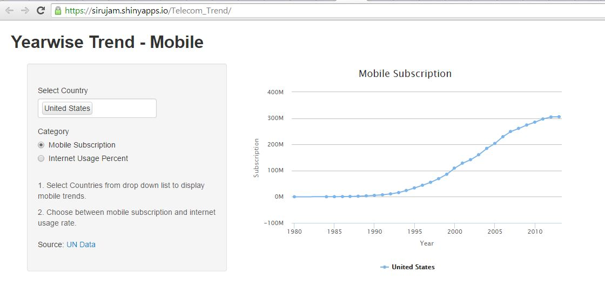

## Introduction :: 

* From 1980 to 2014, worldwide mobile subscription has reached from practically zero to 7 billion.
* However trend differs in developing and developed countries.
  * Developed countries has reached saturation in mobile subscritpion with more than 100% mpbile subscription rate.
  * Developing countries is still growing exponentially in mobile Subscription.
* Internet is becoming important aspect in ever increasing connected world.
  * Understanding these trend provides exploring new opportunities in mobile market.

---

## Shiny App :: Telecom Trend
<div>
    
</div>
<p>
  App ::
  <a href = "http://sirujam.shinyapps.io/Telecom_Trend"> Telecom Trend App Hosted by shinyapps.io </a>
  </p>
  <p>
    Data Source ::
  <a href="data.un.org"> UN Data </a>
</p>    

--- 

## Features
* Selection of countries for comparision
* Seleciton between Mobile Subscription and Internet penetration Rate
* Data taken from ITU (UN Data)

---

## Features

Subsetting for the country selection

```r
  Country <- "Nepal"
  r <- data.frame(Country = c("Afghanistan","Nepal","United States"))
  for (i in Country){
    if(exists("good")) good <- good | r$Country == i
    else good <- r$Country == i      
  }
  good
```

```
## [1] FALSE  TRUE FALSE
```


